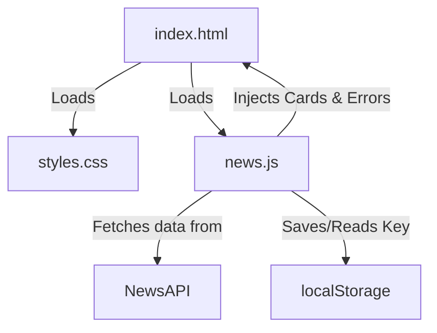
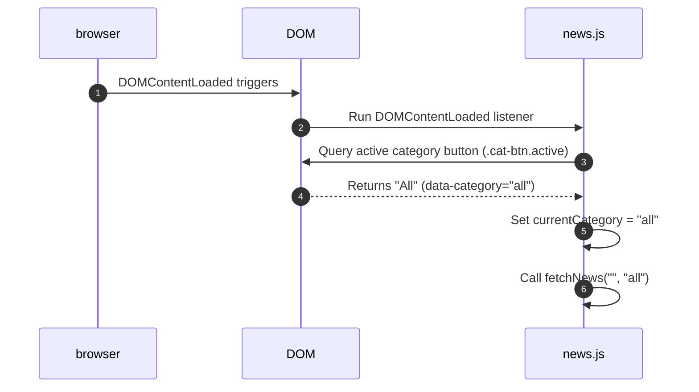
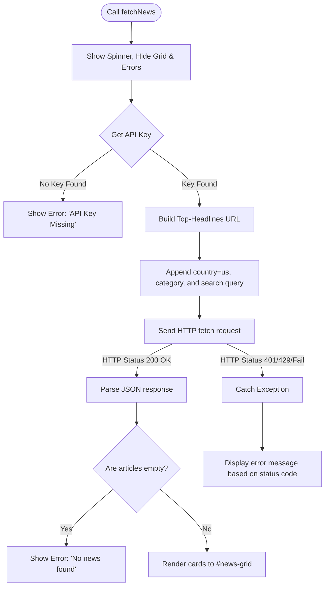
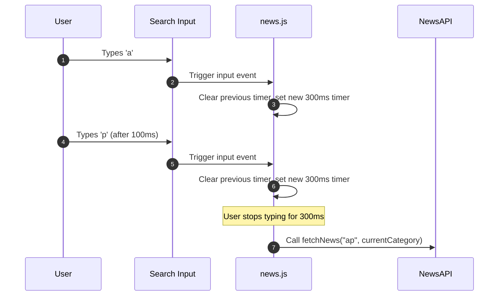

# NewsFlow Architectural & Execution Workflow

This document provides a detailed, step-by-step breakdown of how the **NewsFlow** application works, from initial page load to user interactions, API state handling, and data rendering.

---

## 1. File Structure Overview

The application is built as a modular Single Page Application (SPA):

* **`index.html`**: Defines the semantic structure of the app (Header, Category Bar, Spinner container, Error block, News grid container, and the API Key configuration Modal).
* **`styles.css`**: Manages the visual system. Implements custom styling tokens (CSS variables), layouts (Flexbox/Grid), responsive views, and hardware-accelerated animations (such as card slide-ups and spinners).
* **`news.js`**: Handles logic. Triggers API requests, maintains app state (active category, search query), filters results, debounces keyboard searches, renders HTML templates dynamically, and manages error boundaries.
* **No `package.json` / No `node_modules`**: The project is entirely serverless and client-side, running directly from the `file://` protocol or any static server without local server runtime dependencies.

---

## 2. Initialization Workflow (On Page Load)

When a user opens the application, the following sequence of events executes automatically:

1. **DOM Load Event**: The browser parses the HTML document and triggers the `DOMContentLoaded` event.
2. **State Alignment**: In `news.js`, the app queries the active category button (by default, the **All** button) and synchronizes the global state:
   - `currentCategory` is updated to the button's `data-category` attribute value (`"all"`).
   - `currentQuery` remains initialized to an empty string (`""`).
3. **Initial Request**: `news.js` automatically calls `fetchNews(currentQuery, currentCategory)`.

---

## 3. Data Fetching Workflow (`fetchNews`)

The `fetchNews(query, category)` function manages the API request lifecycle, toggling visual states based on the request's status:

### Detailed Steps:
1. **Reset Viewports**: The app removes the `.hidden` class from the `#loading-state` spinner and adds it to `#news-grid` and `#error-state` to ensure a clean slate.
2. **Resolve API Key**: The utility reads the key using `getApiKey()`:
   - First, it checks browser `localStorage` under the key `"newsflow_api_key"`.
   - If empty, it falls back to the hardcoded `API_KEY` constant in `news.js`.
   - If both are blank, it halts execution and triggers a custom error card asking the user to configure a key.
3. **Build API Endpoint**:
   - The code instantiates a standard `URL` object targeting `https://newsapi.org/v2/top-headlines`.
   - Appends the resolved API key, sets `pageSize` to `40` (to secure a solid pool of articles containing images), and hardcodes the target country to `"us"`.
   - If the selected category is not `"all"`, it appends `&category=<category>`.
   - If a search query is present, it appends `&q=<query>`.
4. **Execute Request**: The network request wraps the NewsAPI URL with the **AllOrigins CORS Proxy** (`https://api.allorigins.win/raw?url=`) and is fetched asynchronously. This allows the application to execute queries directly from local files (`file://` protocol) without triggering CORS or NewsAPI browser origin restriction blocks.
5. **Handle Success**:
   - If the response is successful (`res.ok`), it parses the JSON structure.
   - It checks if the parsed object contains backend API errors (e.g. `data.status === "error"`). If an error is returned through the proxy, it maps the code (e.g. `apiKeyInvalid` to status 401, `rateLimited` to status 429) and throws an exception to be processed by the catch block.
   - If the returned articles array is empty, it triggers `showError("No news found for that search.", false)`.
   - If articles exist, it hides the loading state, shows the grid, and calls `renderNews(articles)`.
6. **Handle Failures**:
   - If the response is not ok, it throws an object containing the status code.
   - The `catch` block identifies the status code (e.g., `401` for unauthorized, `429` for rate limits) and renders the appropriate error message.

---

## 4. UI Rendering Workflow (`renderNews`)

Once raw news data is successfully fetched, `renderNews(articles)` compiles card elements dynamically:

1. **Clear Grid**: The grid's inner HTML is reset (`newsGrid.innerHTML = ""`).
2. **Filter & Slice**: The articles array is filtered to keep only items with images. The list is then sliced to exactly 15 articles (`articles.slice(0, 15)`) to fill exactly 5 rows of 3 cards on desktop view, ensuring visual symmetry across sections.
3. **Card Assembly Loop**: For each remaining article object, a parent `.card` `div` is created.
4. **Safety Fallbacks**:
   - **Image**: If the API's `urlToImage` is missing, the article is filtered out and is not rendered at all. If an image URL exists but fails to load (due to CORS or 404) during runtime, an `onerror` handler removes the entire `.card` element from the DOM. This ensures that every news card shown always contains a successfully loaded, high-fidelity image.
   - **Source**: Defaults to `"News"` if `article.source.name` is null.
   - **Date**: Formatted to a localized string (`toLocaleDateString()`), defaulting to today's date if missing.
   - **Title & Links**: Configured safely to avoid runtime exceptions.
4. **Staggered Animations**:
   - Each card is assigned the class `.fade-up` which triggers a CSS keyframe animation moving the element up while increasing opacity.
   - To make the grid feel alive, `card.style.animationDelay` is calculated dynamically based on its index: `(i * 0.06)s`. This creates a cascading, wave-like entrance effect.
5. **DOM Append**: The card element is appended to `#news-grid`.

---

## 5. Interaction Workflows

### A. Debounced Searching
To prevent flooding NewsAPI with requests for every single keystroke (which rapidly triggers 429 rate limit errors), a custom debounce utility is implemented:

- When the user types, the `input` event listener triggers `debouncedSearch(value)`.
- The `debounce` utility clears any active timeout timer and schedules a new execution of the search function in 300 milliseconds.
- If the user types another letter before the 300ms finishes, the previous scheduled execution is canceled, and a new timer starts.
- Once typing stops for 300ms, `fetchNews(currentQuery, currentCategory)` runs with the final input string.

### B. Category Filtering
1. The user clicks a category button (e.g. **Business**).
2. The click event listener executes.
3. It removes the `.active` class from all buttons and adds it to the clicked button.
4. It reads the `data-category` attribute (e.g., `"business"`) and updates `currentCategory`.
5. It triggers a fresh call: `fetchNews(currentQuery, "business")`.

### C. Live API Configuration Modal
1. The user clicks the Settings key icon in the header.
2. The `#api-modal` backdrop fades in (removing the `.hidden` class).
3. The modal input is populated with the active API key (from `localStorage` or `news.js`).
4. **Save Action**: Saves the input value to `localStorage` under `"newsflow_api_key"`, hides the modal, and refetches news.
5. **Clear Action**: Deletes the saved key from `localStorage`, resets the input box, hides the modal, and refetches news (reverting to `news.js`'s default constant).

---

## 6. Image-Only Card Enforcement

The following screenshots illustrate the UI behavior:

* **Before (Broken Images / Empty Gaps)**: Shows standard broken image placeholder icons for articles with forbidden hotlinks, or cards with blank visual areas when images are omitted.
  

* **After (Filtering Out Non-Image News)**: The application ensures only articles with working images are rendered. If an image fails to load, the card is removed entirely from the layout.
  

