# NewsFlow — Architectural & Execution Workflow

This document provides a detailed, step-by-step breakdown of how the **NewsFlow** application works — from initial page load to user interactions, API state handling, and data rendering — based on the actual source code.

---

## 1. File Structure Overview

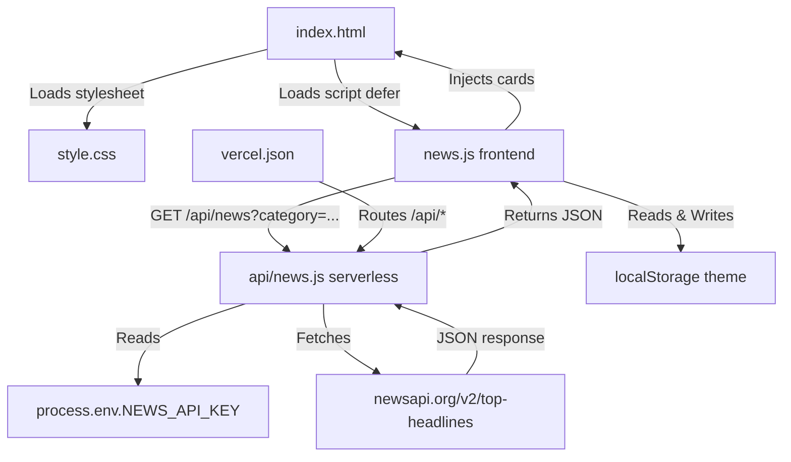

| File | Role |
|---|---|
| `index.html` | Semantic HTML structure — header, category bar, grid, modal |
| `style.css` | CSS variables for dark/light theming, card layout, animations |
| `news.js` *(frontend)* | Fetches via proxy, renders cards, handles search, dark mode, modal |
| `api/news.js` *(serverless)* | Vercel function — proxies NewsAPI calls server-side, hides API key |
| `vercel.json` | Routes `/api/*` requests to the serverless functions folder |
| `README.md` | Setup and deployment documentation |

---

## 2. Initialization Workflow — On Page Load

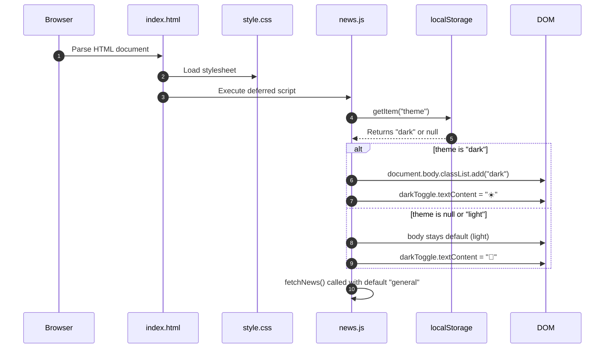

**From `news.js` lines 1–8:**
```js
const newsGrid     = document.getElementById("news-grid");
const searchInput  = document.getElementById("search-input");
const loadingState = document.getElementById("loading-state");
const errorState   = document.getElementById("error-state");
```

All DOM references are grabbed once at the top. Then the dark mode preference is restored from `localStorage`, and `fetchNews()` fires automatically on load.

---

## 3. Dark Mode Workflow

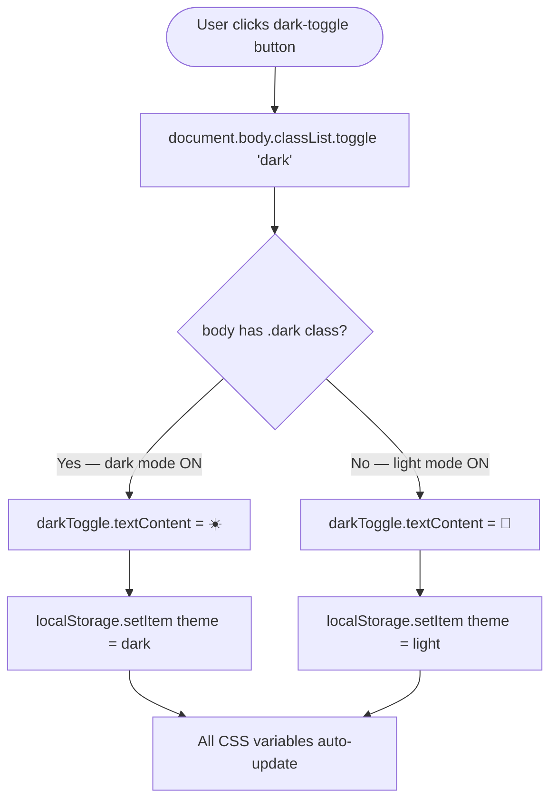

**From `news.js`:**
```js
const darkToggle = document.getElementById("dark-toggle");

if (localStorage.getItem("theme") === "dark") {
  document.body.classList.add("dark");
  darkToggle.textContent = "☀️";
}

darkToggle.addEventListener("click", () => {
  document.body.classList.toggle("dark");
  const isDark = document.body.classList.contains("dark");
  darkToggle.textContent = isDark ? "☀️" : "🌙";
  localStorage.setItem("theme", isDark ? "dark" : "light");
});
```

**How CSS variables enable one-class theming — from `style.css`:**
```css
/* Light mode — applied by default */
:root {
  --bg-page:     #f4f4f4;
  --bg-header:   #333;
  --bg-catbar:   #ddd;
  --bg-card:     #ffffff;
  --bg-modal:    #ffffff;
  --bg-input:    #ffffff;
  --border-card: #ddd;
  --text-primary:#1a1a1a;
  --text-muted:  #666;
  --text-date:   #999;
  --cat-active-bg: #4f46e5;
  --toggle-bg:   #555;
}

/* Dark mode — overrides every variable at once */
body.dark {
  --bg-page:     #0d0d0d;
  --bg-header:   #0d0d0d;
  --bg-catbar:   #111;
  --bg-card:     #161616;
  --bg-modal:    #161616;
  --bg-input:    #0d0d0d;
  --border-card: #2a2a2a;
  --text-primary:#e8e8e8;
  --text-muted:  #999;
  --text-date:   #555;
  --cat-active-bg: #6366f1;
  --toggle-bg:   #222;
}
```

Adding or removing `body.dark` triggers a cascade that instantly repaints every element — no per-element overrides needed.

---

## 4. Data Fetching Workflow — `fetchNews(category)`

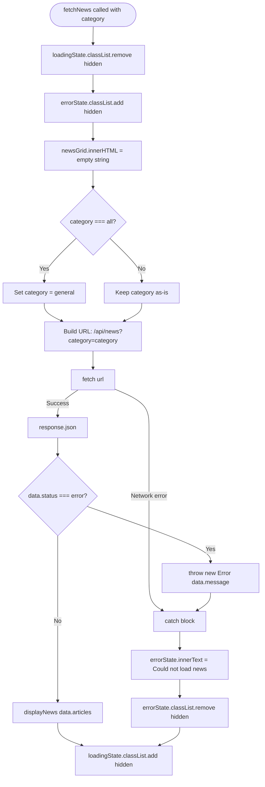

**From `news.js`:**
```js
async function fetchNews(category = "general") {

  loadingState.classList.remove("hidden");
  errorState.classList.add("hidden");
  newsGrid.innerHTML = "";

  if (category === "all") {
    category = "general";
  }

  // Calls our Vercel proxy — NOT NewsAPI directly
  const url = `/api/news?category=${category}`;

  try {
    const response = await fetch(url);
    const data = await response.json();

    if (data.status === "error") {
      throw new Error(data.message);
    }
    displayNews(data.articles);

  } catch (error) {
    errorState.innerText = "Could not load news. Check your key or try again.";
    errorState.classList.remove("hidden");
  }
  loadingState.classList.add("hidden");
}
```

---

## 5. Serverless Proxy Workflow — `api/news.js`

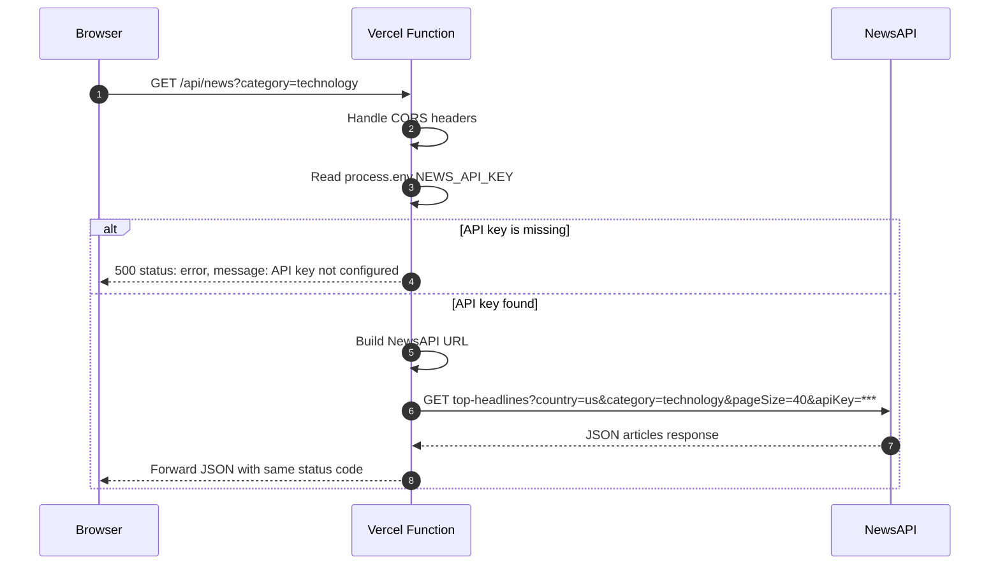

**From `api/news.js`:**
```js
export default async function handler(req, res) {
  res.setHeader('Access-Control-Allow-Origin', '*');
  res.setHeader('Access-Control-Allow-Methods', 'GET, OPTIONS');
  res.setHeader('Access-Control-Allow-Headers', 'Content-Type');

  if (req.method === 'OPTIONS') {
    return res.status(200).end();
  }

  const { query, category } = req.query;
  const apiKey = process.env.NEWS_API_KEY;

  if (!apiKey) {
    return res.status(500).json({
      status: "error",
      message: "API key not configured on server."
    });
  }

  const url = new URL("https://newsapi.org/v2/top-headlines");
  url.searchParams.set("apiKey", apiKey);
  url.searchParams.set("country", "us");
  url.searchParams.set("pageSize", "40");

  if (category && category !== "all") {
    url.searchParams.set("category", category);
  }
  if (query) {
    url.searchParams.set("q", query);
  }

  try {
    const apiRes = await fetch(url.toString());
    const data = await apiRes.json();
    return res.status(apiRes.status).json(data);
  } catch (error) {
    return res.status(500).json({
      status: "error",
      message: "Internal server proxy error."
    });
  }
}
```

**Why the proxy is required:**

| Context | Direct NewsAPI call | Via `/api/news` Proxy |
|---|---|---|
| `localhost` dev | ✅ Allowed by NewsAPI | ✅ Works |
| Vercel production | ❌ Blocked — CORS error | ✅ Server-side, no CORS |
| API key visibility | ❌ Exposed in browser JS | ✅ Hidden in env variable |

---

## 6. Card Rendering Workflow — `displayNews(articles)`

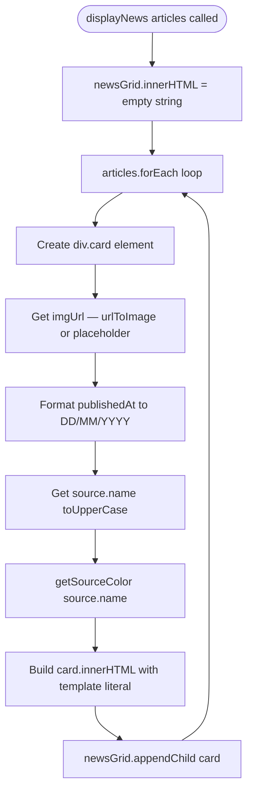

**From `news.js`:**
```js
function displayNews(articles) {
  newsGrid.innerHTML = "";

  articles.forEach(article => {
    const card = document.createElement("div");
    card.className = "card";

    const imgUrl = article.urlToImage
      ? article.urlToImage
      : "https://placehold.co/400x180/1a1a2e/555555?text=No+Image";

    const date = article.publishedAt
      ? new Date(article.publishedAt).toLocaleDateString("en-GB")
      : "";

    const source = article.source?.name
      ? article.source.name.toUpperCase()
      : "";

    const sourceColor = getSourceColor(article.source?.name || "");

    card.innerHTML = `
      
      <span class="source-badge" style="background:${sourceColor}">${source}</span>
      <h3>${article.title}</h3>
      <p class="date">${date}</p>
      <a href="${article.url}" target="_blank">Read More</a>
    `;

    newsGrid.appendChild(card);
  });
}
```

**Safety fallbacks:**

| Field | Fallback |
|---|---|
| `urlToImage` is null | Shows placeholder image via `imgUrl` check |
| Image URL exists but broken | `onerror` replaces with placeholder |
| `source.name` is null | Defaults to empty string |
| `publishedAt` is null | Defaults to empty string |
| `description` missing | Not rendered in current template |

---

## 7. Source Badge Color Workflow — `getSourceColor()`

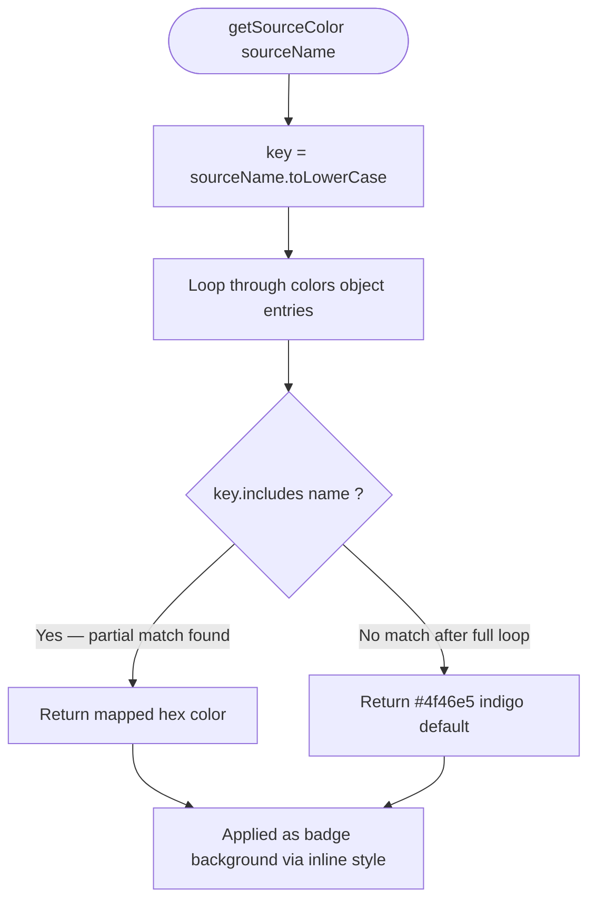

**From `news.js`:**
```js
function getSourceColor(sourceName) {
  const colors = {
    "associated press" : "#c0392b",  // red
    "reuters"          : "#e67e22",  // orange
    "bbc news"         : "#c0392b",  // red
    "cnn"              : "#cc0000",  // dark red
    "the verge"        : "#e91e8c",  // pink
    "techcrunch"       : "#0a8f08",  // green
    "politico"         : "#2980b9",  // blue
    "financial times"  : "#b8860b",  // gold
    "mma fighting"     : "#6c3483",  // purple
    "suntimes.com"     : "#16a085",  // teal
  };

  const key = sourceName.toLowerCase();

  for (const [name, color] of Object.entries(colors)) {
    if (key.includes(name)) return color;
  }

  return "#4f46e5"; // default indigo fallback
}
```

Uses `key.includes(name)` for partial matching — so `"BBC News (UK)"` still matches `"bbc news"`.

---

## 8. Interaction Workflows

### A. Category Filtering

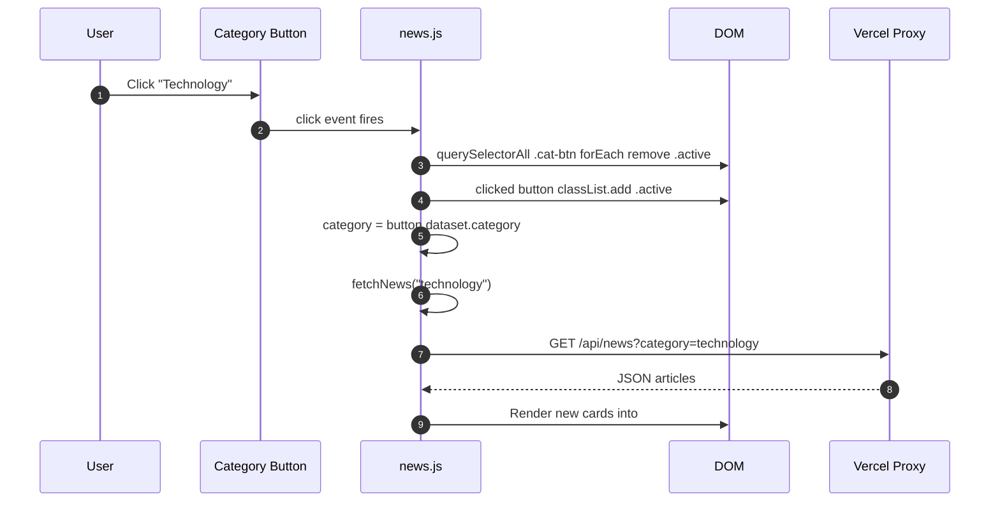

**From `news.js`:**
```js
document.querySelectorAll(".cat-btn").forEach(button => {
  button.addEventListener("click", () => {
    document.querySelectorAll(".cat-btn").forEach(b => b.classList.remove("active"));
    button.classList.add("active");
    const category = button.dataset.category;
    fetchNews(category);
  });
});
```

### B. Live Search (Client-side)

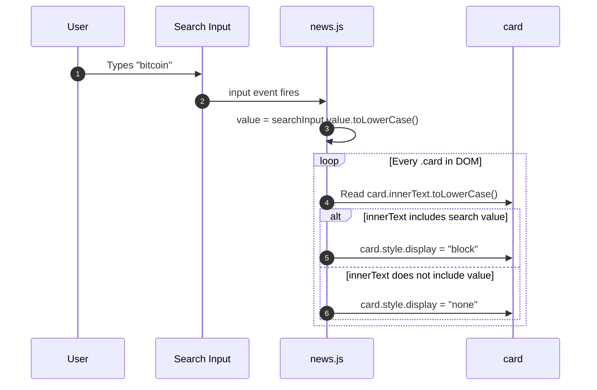

**From `news.js`:**
```js
searchInput.addEventListener("input", () => {
  const value = searchInput.value.toLowerCase();

  document.querySelectorAll(".card").forEach(card => {
    const title = card.innerText.toLowerCase();

    if (title.includes(value))
      card.style.display = "block";
    else
      card.style.display = "none";
  });
});
```

> Search is **fully client-side** — no new API call is made. It filters already-rendered cards instantly on every keystroke.

### C. Settings Modal

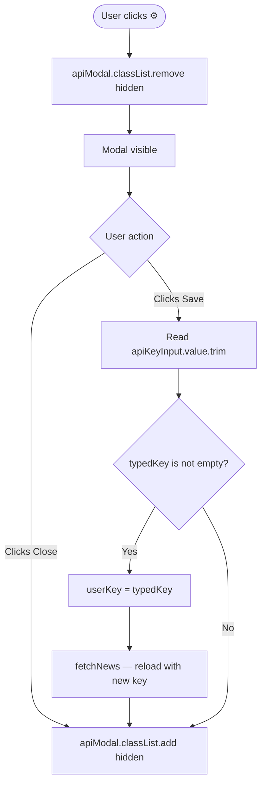

**From `news.js`:**
```js
settingsBtn.addEventListener("click", () => {
  apiModal.classList.remove("hidden");
});

closeModalBtn.addEventListener("click", () => {
  apiModal.classList.add("hidden");
});

saveApiBtn.addEventListener("click", () => {
  const typedKey = apiKeyInput.value.trim();
  if (typedKey) {
    userKey = typedKey;
    fetchNews();
  }
  apiModal.classList.add("hidden");
});
```

---

## 9. Card Layout — CSS Flexbox Architecture

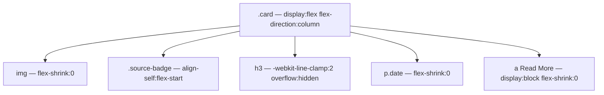

**From `style.css`:**
```css
.card {
  background: var(--bg-card);
  border: 1px solid var(--border-card);
  padding: 14px;
  border-radius: 12px;
  display: flex;
  flex-direction: column;   /* stacks children vertically */
}

.card img {
  width: 100%;
  height: 180px;
  border-radius: 12px;
  object-fit: cover;
  flex-shrink: 0;           /* image never squishes */
}

.source-badge {
  align-self: flex-start;   /* badge shrinks to text width */
}

.card h3 {
  display: -webkit-box;
  -webkit-line-clamp: 2;    /* max 2 lines */
  -webkit-box-orient: vertical;
  overflow: hidden;          /* shows ... after 2 lines */
}

.card a {
  display: block;
  text-align: center;
  flex-shrink: 0;           /* button never squishes */
  box-sizing: border-box;
}
```

---

## 10. Error Boundary Workflow

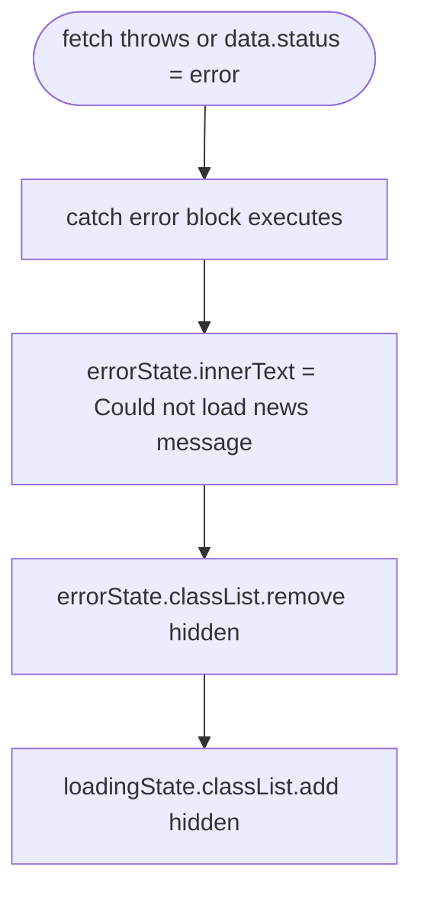

**Error scenarios and messages:**

| Scenario | Source | Message shown |
|---|---|---|
| `NEWS_API_KEY` not set in Vercel | `api/news.js` | `"API key not configured on server."` |
| NewsAPI returns `status: "error"` | NewsAPI response | `data.message` from API |
| Network failure or fetch throws | Browser / catch block | `"Could not load news. Check your key or try again."` |
| Proxy internal error | `api/news.js` catch | `"Internal server proxy error."` |

---

## 11. Complete End-to-End Request Lifecycle

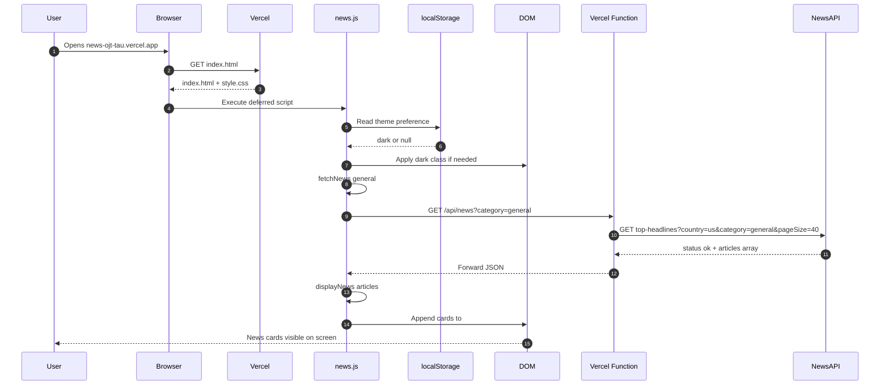

---

## 12. All Issues Fixed During Development

| # | Problem | Root Cause | Fix Applied |
|---|---|---|---|
| 1 | CORS error on Vercel | NewsAPI blocks browser requests from deployed domains | Created `api/news.js` serverless proxy |
| 2 | API key exposed in JS | Hardcoded in frontend `news.js` | Moved to `process.env.NEWS_API_KEY` in Vercel |
| 3 | Read More button overflowing card | `display:flex` accidentally on `.card img` not `.card` | Moved flex properties to `.card` |
| 4 | Buttons at different heights | `flex:1` on `h3` instead of `p` | Moved `flex:1` to `.card p` |
| 5 | Source badge full width | Flex column stretches all children | Added `align-self: flex-start` to `.source-badge` |
| 6 | Long titles not truncating | `overflow:hidden` missing from `h3` | Added `-webkit-line-clamp` + `overflow:hidden` |
| 7 | White card in dark mode | Hardcoded `background: white` on `.card` | Replaced with `var(--bg-card)` |
| 8 | Dark mode resets on refresh | No persistence | Used `localStorage` to save and restore preference |
| 9 | Fixed height causing overflow | `height: 400px` on `.card` | Removed — flexbox handles height naturally |
| 10 | Broken image shows blank space | `onerror` hid image but kept card space | `onerror` now replaces `src` with placeholder |

---

## 👤 Developer

**Md Shaha Ul Alam**
B.Tech CSE — PW Institute of Innovation (Medhavi Skill University), Bangalore
Batch: BEN01SOTUGBTC25B01
GitHub: [github.com/shahaulalam85](https://github.com/shahaulalam85)
Live: [news-ojt-tau.vercel.app](https://news-ojt-tau.vercel.app)